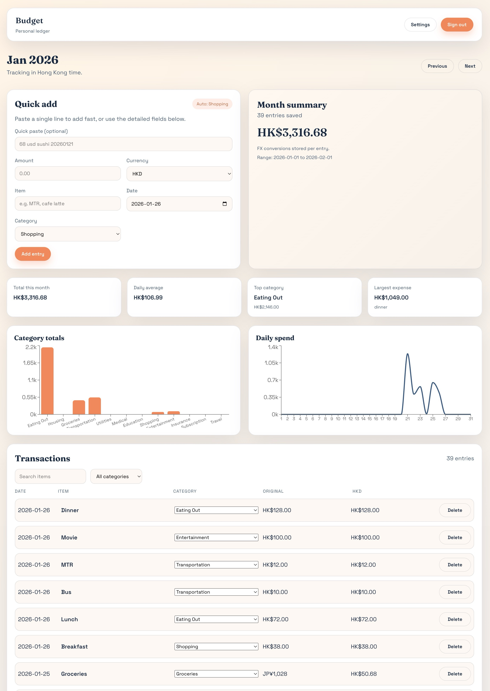
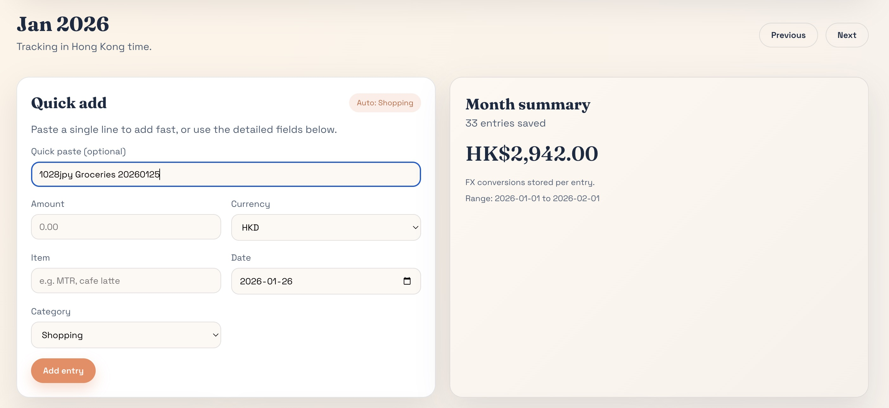
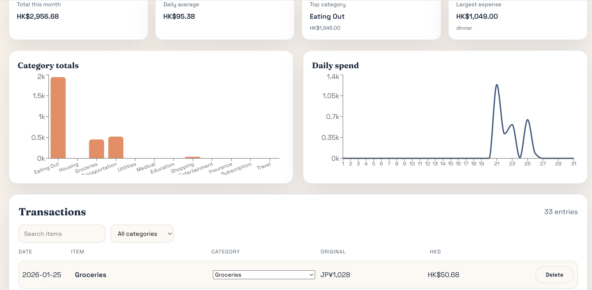
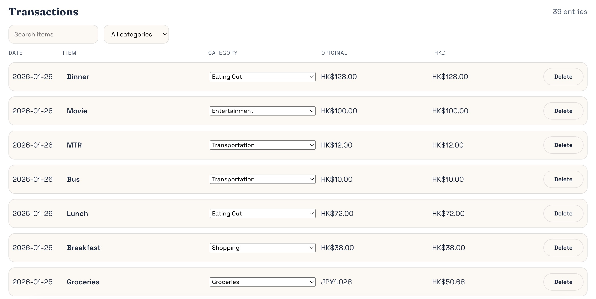

# Budget Monitoring Ledger

A fast, everyday spending tracker for busy city life. The goal is simple: capture daily expenses without friction, then let the data speak.

I built this with the same mindset I use for real estate, construction and project management: track resources, control variance, and keep decisions grounded in real numbers. Many personal finance apps hide basic workflows behind paid subscriptions. This project keeps the core workflow open, lightweight, and accessible to anyone from all walks of life.

Live demo (no-login): https://web-navy-alpha-40.vercel.app

## Highlights

- **Natural language entry**: paste a single line like `68 usd sushi 2026-01-21`.
- **Auto-categorization**: deterministic keyword rules you can inspect and extend.
- **FX-aware ledger**: every entry stores the original amount and the HKD conversion.
- **Exportable data**: download your transactions and rules as JSON.

## Screenshots






## How auto-categorization works

Rules are simple and transparent so you can trust the results.

- Starter keywords live in `web/src/lib/categories.ts`.
- Your custom keywords are stored in Supabase (`category_rules`).
- Each item is normalized (lowercase, punctuation removed) and scored in `web/src/lib/categorize.ts`:
  - exact word match: `+3`
  - substring match: `+1`
  - tie-breakers: higher exact matches, then alphabetical category name
  - fallback: `Shopping` if no matches are found

See `docs/auto-categorization.md` for examples and tips.

## Natural language parsing

The quick-paste line accepts:

- amount (with commas)
- currency codes (`HKD`, `USD`, `JPY`, etc.) and aliases (`HK$`, `US$`, `RMB`)
- date as `YYYY-MM-DD` or `YYYYMMDD`
- item/merchant text

Parsing rules live in `web/src/lib/smartText.ts`.

## FX conversion

Rates are fetched from the Frankfurter API and cached in `localStorage`. If you are offline, the app uses cached rates. It also looks back up to 7 days to handle weekends and holidays.

Conversion logic lives in `web/src/lib/fx.ts`. Full details: `docs/currency-conversion.md`.

## Tech stack

- React + Vite
- Supabase (Auth + Postgres)
- Recharts for charts

## Demo mode (no login)

The demo runs without Supabase and stores data locally in the browser. You can reset demo data from Settings.

```
cd web
VITE_DEMO_MODE=true npm run dev
```

## Local setup

1. Create a Supabase project and run the schema in `supabase/schema.sql`.
2. Configure environment variables:

```
cd web
cp .env.example .env.local
```

3. Install and run:

```
cd web
npm install
npm run dev
```

## Repo structure

- `web/` - frontend app
- `supabase/` - database schema
- `docs/` - architecture and mechanism notes
